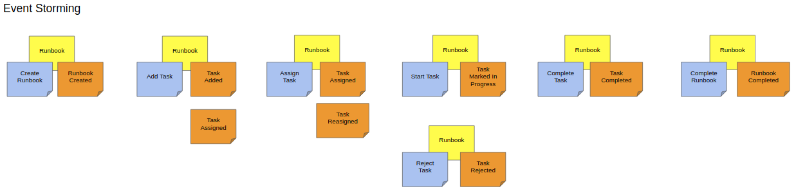

# runbook-ddd-kotlin

A sample microservice using DDD and a clean architecture. Implemented in Kotlin and Spring Boot.

## The Domain
For this sample application, we will work in an operations team domain. Our focus will be on the concept of a **Runbook** which tracks **Tasks**. 

A Runbook is used to track all the tasks to be completed in order for a new system deployment or maintenance operation to be done. 
Operations planner can: create a runbook for a project, add a task to the runbook, assign a task to an operator, reassign a task. 
A task can be marked in progress only by the task assignee. An in-progress task can be completed or rejected. 
When all tasks in the runbook are completed and/or rejected, a runbook can be marked as completed.
To keep it simple, there are no dependencies between tasks thus can be completed in any order.

## Documentation
Links to some of the articles and documentation used to implement this project:

- Implementing Domain-Driven Design, Vaughn Vernon.
- IDDD Samples https://github.com/VaughnVernon/IDDD_Samples
- Building web applications with Spring Boot and Kotlin https://spring.io/guides/tutorials/spring-boot-kotlin/
- Retrieve User Information in Spring Security http://www.baeldung.com/get-user-in-spring-security

TODO:
- Configure REDIS 
http://www.baeldung.com/spring-data-redis-tutorial
https://docs.spring.io/spring-data/redis/docs/2.0.7.RELEASE/reference/html/#get-started
https://github.com/spring-projects/spring-data-examples/tree/master/redis/repositories

- With Redis the Tasks are saved directly the in the Runbook aggregate, No need for a Tasks repo then. And Task
does not need the RedisHash.